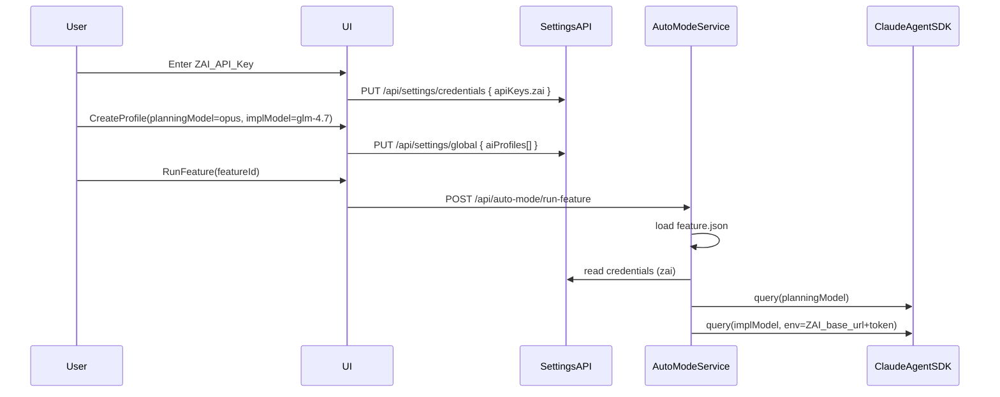

# Add GLM 4.7 + Endpoint Selection + Plan-vs-Code Models

## What exists today (baseline)

- **Agent execution path is SDK-based (not the `claude` CLI)**:
- Main provider is `ClaudeProvider` using `query()` from `@anthropic-ai/claude-agent-sdk` ([`apps/server/src/providers/claude-provider.ts`](apps/server/src/providers/claude-provider.ts)).
- Auto-mode runs a feature with a single resolved model via `resolveModelString(feature.model, DEFAULT_MODELS.claude)` ([`apps/server/src/services/auto-mode-service.ts`](apps/server/src/services/auto-mode-service.ts)).
- **Profiles are UI-defined and stored in global settings**:
- Built-ins: Heavy Task (opus), Balanced (sonnet), Quick Edit (haiku) in [`apps/ui/src/store/app-store.ts`](apps/ui/src/store/app-store.ts).
- Profile creation UI: single model picker (haiku/sonnet/opus) in [`apps/ui/src/components/views/profiles-view/components/profile-form.tsx`](apps/ui/src/components/views/profiles-view/components/profile-form.tsx).
- **API keys**:
- UI stores keys in Zustand and can sync to server credentials via `syncCredentialsToServer()` ([`apps/ui/src/hooks/use-settings-migration.ts`](apps/ui/src/hooks/use-settings-migration.ts)).
- Backend persists credentials unencrypted in `{DATA_DIR}/credentials.json` via `SettingsService.updateCredentials()` ([`apps/server/src/services/settings-service.ts`](apps/server/src/services/settings-service.ts)).
- **Model resolution**:
- `resolveModelString()` currently only understands Claude aliases; unknown keys fall back to default ([`libs/model-resolver/src/resolver.ts`](libs/model-resolver/src/resolver.ts)).

## Z.AI requirements to support GLM Coding Plan

From Z.AI docs ([`https://docs.z.ai/devpack/tool/claude`](https://docs.z.ai/devpack/tool/claude)):

- **Endpoint**: `ANTHROPIC_BASE_URL="https://api.z.ai/api/anthropic"`
- **Auth**: `ANTHROPIC_AUTH_TOKEN="<your_zai_api_key>"`
- **Timeout** (recommended by Z.AI): `API_TIMEOUT_MS="3000000"`
- (Optional) model mapping env vars exist for Claude Code CLI, but **we’ll expose GLM-4.7 explicitly**, so we don’t need to rely on those mappings.

## Target behavior

### Settings → API Keys

- Add a new **Z.AI (GLM Coding Plan) API key** field.
- Persist to server credentials (`credentials.json`) via `/api/settings/credentials` (through `syncCredentialsToServer`).

### AI Profiles

- In “Add new profile”, allow selecting:
- **Planning model** (e.g. Claude Opus)
- **Implementation model** (e.g. GLM-4.7)
- Add **GLM-4.7** as a model option (UI label “GLM 4.7”), positioned **between Sonnet and Opus** in model lists.
- For implementation model GLM-4.7, default the endpoint to Z.AI automatically.
- Provide an **Advanced: Custom Endpoint** input in the profile form (implementation-side only) so users can override the base URL (still using the Z.AI key).

### Execution (Auto Mode)

- When `planningMode !== 'skip'`, do a two-stage flow:
- Stage 1: generate plan/spec using **planning model**.
- Stage 2: implement using **implementation model**.
- When implementation model is GLM-4.7 (or custom endpoint), inject env:
- `ANTHROPIC_BASE_URL`
- `ANTHROPIC_AUTH_TOKEN`
- `API_TIMEOUT_MS`

### Execution (Agent Chat)

- If the user selects GLM-4.7 in the chat model dropdown, chat requests should also use the Z.AI endpoint env injection.

## Design: minimal schema additions (backward compatible)

### 1) Types

- **Model ID**:
- Add `glm-4.7` as a valid `AgentModel`.
- Update `resolveModelString()` to treat `glm-` models as passthrough (like `claude-`).
- **Credentials**:
- Add `apiKeys.zai` to `Credentials` and defaults.
- **AIProfile**:
- Keep existing `model` as the **implementation model**.
- Add `planningModel?: AgentModel` (default to `model` when absent).
- Add implementation endpoint override fields (optional):
- `implementationEndpointPreset?: 'default' | 'zai' | 'custom'`
- `implementationEndpointUrl?: string` (only when preset=custom)
- **Feature**:
- Add `planningModel?: string` and implementation endpoint override fields so execution is deterministic per feature.
- Keep existing `model` as implementation model.

### 2) Env injection contract

- Extend provider execution options so we can pass env without touching global `process.env`:
- Add `providerConfig?: ProviderConfig` to `ExecuteOptions` in [`libs/types/src/provider.ts`](libs/types/src/provider.ts).
- Use `providerConfig.env` to carry `ANTHROPIC_BASE_URL`, `ANTHROPIC_AUTH_TOKEN`, etc.

> Implementation note: first verify whether `@anthropic-ai/claude-agent-sdk` accepts env overrides (e.g. via `Options.env`). If it does, pass through directly. If it does not, implement a safe fallback (see “Edge cases + fallback” below).

## Implementation steps (files to touch)

### A) Add GLM-4.7 model support end-to-end

- Update model types:
- [`libs/types/src/model.ts`](libs/types/src/model.ts): extend `AgentModel` to include `'glm-4.7'`.
- [`libs/model-resolver/src/resolver.ts`](libs/model-resolver/src/resolver.ts): treat `glm-` strings as passthrough.
- Update display helpers:
- [`apps/ui/src/lib/utils.ts`](apps/ui/src/lib/utils.ts): add GLM to `getModelDisplayName()`, and update `modelSupportsThinking()` to return **false** for `glm-4.7`.
- UI model lists:
- [`apps/ui/src/components/views/profiles-view/constants.ts`](apps/ui/src/components/views/profiles-view/constants.ts)
- [`apps/ui/src/components/views/board-view/shared/model-constants.ts`](apps/ui/src/components/views/board-view/shared/model-constants.ts)
- [`libs/types/src/model-display.ts`](libs/types/src/model-display.ts) if used elsewhere

### B) Add Z.AI API key to Settings → API Keys

- UI schema/state:
- [`apps/ui/src/store/app-store.ts`](apps/ui/src/store/app-store.ts): extend `ApiKeys` to include `zai: string` and default it to `''`.
- UI settings form:
- [`apps/ui/src/config/api-providers.ts`](apps/ui/src/config/api-providers.ts): add a provider config entry for Z.AI.
- [`apps/ui/src/components/views/settings-view/api-keys/hooks/use-api-key-management.ts`](apps/ui/src/components/views/settings-view/api-keys/hooks/use-api-key-management.ts):
- Add `zaiKey` state + show/hide.
- Update `handleSave()` to:
- update Zustand `apiKeys`
- call `syncCredentialsToServer({ zai: zaiKey, ... })`
- Add a **Z.AI connection test** that calls a new/extended backend verify route.
- Credentials sync typing:
- [`apps/ui/src/hooks/use-settings-migration.ts`](apps/ui/src/hooks/use-settings-migration.ts): add `zai?: string` to `syncCredentialsToServer` argument.
- Backend credentials schema:
- [`libs/types/src/settings.ts`](libs/types/src/settings.ts): add `Credentials.apiKeys.zai` + update defaults.
- [`apps/server/src/services/settings-service.ts`](apps/server/src/services/settings-service.ts): ensure migration and defaults include `zai`.

### C) Extend AI Profiles UI to support plan-vs-code + GLM + endpoint override

- Data model:
- [`libs/types/src/settings.ts`](libs/types/src/settings.ts): add `planningModel?`, and implementation endpoint override fields to `AIProfile`.
- Profile form:
- [`apps/ui/src/components/views/profiles-view/components/profile-form.tsx`](apps/ui/src/components/views/profiles-view/components/profile-form.tsx):
- Replace single “Model” picker with:
- **Planning Model** picker
- **Implementation Model** picker (includes GLM-4.7)
- Add an “Implementation Endpoint” section:
- Default: “Automatic (based on model)”
- When implementation model is GLM-4.7, default preset to Z.AI.
- Advanced: allow “Custom” + URL input.
- Validation:
- If implementation model is GLM-4.7 and `apiKeys.zai` is empty → block save with clear error.
- Built-in profiles:
- [`apps/ui/src/store/app-store.ts`](apps/ui/src/store/app-store.ts): update default profiles to include `planningModel` (same as existing) and endpoint preset defaults.
- Optional (recommended): add a **built-in** profile:
- “GLM Coding (Plan Opus, Code GLM-4.7)” (planningModel=opus, model=glm-4.7)

### D) Propagate profile settings into Features

- Feature schema:
- [`libs/types/src/feature.ts`](libs/types/src/feature.ts): add `planningModel?: string`, `implementationEndpointPreset?`, `implementationEndpointUrl?`.
- UI feature create/edit:
- [`apps/ui/src/components/views/board-view/dialogs/add-feature-dialog.tsx`](apps/ui/src/components/views/board-view/dialogs/add-feature-dialog.tsx):
- When a default profile is applied, set:
- `model` (implementation)
- `planningModel`
- endpoint override fields
- If user manually changes implementation model to GLM-4.7, set endpoint preset to Z.AI by default.
- [`apps/ui/src/components/views/board-view/dialogs/edit-feature-dialog.tsx`](apps/ui/src/components/views/board-view/dialogs/edit-feature-dialog.tsx):
- Add fields to edit planning model + implementation model + endpoint override.
- Profile quick select:
- [`apps/ui/src/components/views/board-view/shared/profile-quick-select.tsx`](apps/ui/src/components/views/board-view/shared/profile-quick-select.tsx): update callback to return both models + endpoint override.

### E) Backend: implement plan-vs-code model execution + Z.AI env injection

- Provider execution options:
- [`libs/types/src/provider.ts`](libs/types/src/provider.ts): add `providerConfig?: ProviderConfig` to `ExecuteOptions`.
- [`apps/server/src/providers/claude-provider.ts`](apps/server/src/providers/claude-provider.ts):
- Accept `providerConfig.env` and pass it to the SDK (preferred) or apply a safe fallback.
- Add GLM-4.7 to `getAvailableModels()` (provider="zai").
- [`apps/server/src/providers/provider-factory.ts`](apps/server/src/providers/provider-factory.ts): treat `glm-` models as supported by ClaudeProvider (avoid warnings).
- Auto-mode execution refactor:
- [`apps/server/src/services/auto-mode-service.ts`](apps/server/src/services/auto-mode-service.ts):
- Read from feature:
- `planningModel = resolveModelString(feature.planningModel ?? feature.model)`
- `implementationModel = resolveModelString(feature.model)`
- Implement two-phase execution when `planningMode !== 'skip'`:
- Phase 1 (planningModel): run a planning-only prompt (new prompts that *stop after* `[PLAN_GENERATED]` / `[SPEC_GENERATED]` and do not proceed).
- Keep the existing approval loop, but it should only re-run **Phase 1**.
- Phase 2 (implementationModel): run continuation prompts / task prompts.
- For each provider call, compute `providerConfig.env` based on the *model being used*:
- If model starts with `glm-` OR endpoint preset is Z.AI/custom:
    - `ANTHROPIC_BASE_URL = (customUrl ?? "https://api.z.ai/api/anthropic")`
    - `ANTHROPIC_AUTH_TOKEN = <credentials.apiKeys.zai>`
    - `API_TIMEOUT_MS = "3000000"`
- Else: no base url override; let Anthropic API key auth apply.
- Hard-fail with a clear error if required credentials are missing.
- Agent chat execution:
- [`apps/server/src/services/agent-service.ts`](apps/server/src/services/agent-service.ts): when effective model is `glm-4.7`, use the same env injection approach.

### F) Verification & UX polish

- Add a “Test Z.AI Connection” button:
- Extend [`apps/server/src/routes/setup/routes/verify-claude-auth.ts`](apps/server/src/routes/setup/routes/verify-claude-auth.ts) OR add a new route under settings to:
- Temporarily execute a minimal `query()` using env injection and `model: "glm-4.7"`.
- Return authenticated/error.
- Update UI copy:
- [`apps/ui/src/components/views/settings-view/api-keys/api-keys-section.tsx`](apps/ui/src/components/views/settings-view/api-keys/api-keys-section.tsx): adjust text (“Keys are stored locally”) to reflect file-based sync in Electron.

## Edge cases + fallback strategy

### Missing credentials

- If user selects GLM-4.7 but `apiKeys.zai` is empty:
- Block profile save and feature run with a clear message pointing to Settings → API Keys.

### SDK does not support per-call env overrides

If `@anthropic-ai/claude-agent-sdk` cannot accept env overrides per query:

- Implement a dedicated **worker process** execution mode for Z.AI calls:
- Spawn a Node child process that runs `query()` with the desired env, stream JSON messages back to parent.
- This keeps global `process.env` safe and supports concurrency.

### Backward compatibility

- Existing profiles without `planningModel` should behave exactly as today.
- Existing features without `planningModel` or endpoint override should behave exactly as today.

## Testing checklist

- **UI**:
- Create profile: Planning=Opus, Implementation=GLM-4.7.
- Attempt create profile with GLM selected and no Z.AI key → expect validation error.
- Add feature using that profile; verify feature.json includes new fields.
- **Backend**:
- Run a feature with planningMode=lite/spec/full and confirm:
- phase 1 uses planning model
- phase 2 uses implementation model
- Run agent chat with GLM-4.7.
- **Playwright / unit tests**:
- Update fixtures that assert built-in profile lists: [`apps/ui/tests/utils/project/setup.ts`](apps/ui/tests/utils/project/setup.ts).
- Ensure existing tests that create features with only `model` still pass.

## Data flow (overview)

